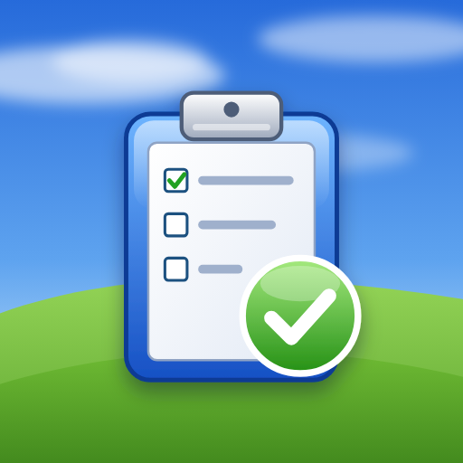

# 📋 Task Manager PWA

A **Windows XP-inspired task manager** built as a Progressive Web App (PWA). It combines light/dark XP themes, Firebase account sync, drag-and-drop organization, repeating alarms, photo attachments, calendar integration, and offline-capable caching.



---

## ✨ Features

### Core Functionality
- **Create & Manage Tasks** – Add tasks with titles, detailed descriptions, and photo attachments
- **Photo Attachments** – Attach compressed Base64 images to cloud-synced tasks
- **Complete & Archive** – Mark tasks complete with visual distinction between active and completed views
- **Drag & Drop Reordering** – Reorganize tasks with intuitive drag-and-drop powered by `@dnd-kit`

### Alarm System
- **Smart Alarms** – Set alarm times for task reminders (24-hour format)
- **Repeating Schedules** – Configure weekly repeating alarms (e.g., Mon, Wed, Fri)
- **Native Notifications** – Full push notification support on Android/iOS via Capacitor
- **Web Notifications** – Browser notification fallback for PWA users
- **Calendar Export** – Export alarms to `.ics` files for native calendar app integration

### Views & Navigation
- **Tasks Grid** – Main view displaying all active tasks
- **Completed Tasks** – Separate view for archived/completed tasks
- **Calendar View** – Visual calendar showing tasks by due date
- **Settings** – Data management, export/import, and notification preferences
- **Sliding Drawer** – Smooth navigation drawer for screen switching

### Offline-First Architecture
- **Firebase Storage Layer** – Per-user task documents synchronize in real time through Firestore
- **IndexedDB Migration** – Existing local Dexie data migrates to Firestore on first sign-in
- **Service Worker** – Full offline capability with custom service worker
- **Automatic Migration** – Legacy localStorage data automatically migrates to IndexedDB
- **Data Export/Import** – Backup and restore all tasks as JSON

### PWA Features
- **Installable** – Add to home screen on mobile and desktop
- **Standalone Mode** – Full-screen app experience without browser UI
- **Offline Ready** – Works completely offline after initial load
- **Android Hardware Back Button** – Native back navigation support

---

## 🛠️ Tech Stack

| Category | Technology |
|----------|------------|
| **Framework** | Next.js 15 (App Router) |
| **Language** | TypeScript |
| **UI Library** | React 19 |
| **Styling** | Tailwind CSS v4 |
| **UI Components** | Radix UI Primitives |
| **Drag & Drop** | @dnd-kit |
| **Storage** | Firebase Firestore with Dexie migration support |
| **Notifications** | Capacitor Local Notifications |
| **Date Handling** | date-fns |
| **Toasts** | Sonner |
| **Charts** | Recharts |
| **Form Handling** | React Hook Form + Zod |
| **Theming** | next-themes |

---

## 📁 Project Structure

```
WEBTODOAPP/
├── app/
│   ├── page.tsx          # Main app component with state management
│   ├── layout.tsx        # Root layout with metadata & PWA config
│   └── globals.css       # Global styles & Tailwind imports
│
├── components/
│   ├── add-task-screen.tsx       # New task creation form
│   ├── calendar-screen.tsx       # Calendar view component
│   ├── settings-screen.tsx       # Settings & data management
│   ├── sliding-drawer.tsx        # Navigation drawer
│   ├── task-detail-screen.tsx    # Individual task view/edit
│   ├── tasks-grid-screen.tsx     # Main task grid display
│   ├── theme-provider.tsx        # Dark/light theme wrapper
│   └── ui/                       # Shadcn/ui component library
│
├── lib/
│   ├── calendar-export.ts    # ICS calendar file generation
│   ├── notifications.ts      # Capacitor native notifications
│   ├── storage-idb.ts        # IndexedDB storage layer (Dexie)
│   ├── storage.ts            # Legacy storage utilities
│   ├── utils.ts              # Utility functions (cn helper)
│   └── web-notifications.ts  # Browser notification fallback
│
├── hooks/
│   └── use-mobile.tsx        # Mobile detection hook
│
├── public/
│   ├── sw.js                 # Service worker for offline
│   ├── manifest.json         # PWA manifest
│   ├── icons/                # App icons (192x192, 512x512)
│   └── images/               # Static assets
│
└── styles/
    └── globals.css           # Additional global styles
```

---

## 🚀 Getting Started

### Prerequisites

- **Node.js** 18.17 or later
- **npm** or **pnpm**

### Installation

1. **Clone the repository**
   ```bash
   git clone https://github.com/yourusername/task-manager.git
   cd task-manager
   ```

2. **Install dependencies**
   ```bash
   npm install
   ```

3. **Run development server**
   ```bash
   npm run dev
   ```

4. **Open in browser**
   ```
   http://localhost:3000
   ```

### Build for Production

```bash
npm run build
npm start
```

---

## 📱 Native App Build (Optional)

This project uses **Capacitor** for native Android/iOS builds.

### Android Build

The `android/` project is committed. Toolchain: JDK 21 and the Android SDK
(platform 36). Point Gradle at them with `JAVA_HOME` and `android/local.properties`
(`sdk.dir=...`).

One-time Firebase setup:

1. `.env.local` must contain the `NEXT_PUBLIC_FIREBASE_*` values — the static
   export bakes them into the APK (`npx vercel env pull .env.local` copies them
   from Vercel).
2. In the Firebase console, add an Android app with package name
   `com.ifrankerem.taskmanager` and the SHA-1 of the signing key
   (`keytool -list -v -keystore ~/.android/debug.keystore -storepass android`).
3. Download `google-services.json` to `android/app/` (gitignored). Native
   Google sign-in needs it.

Build a debug APK:

```bash
JAVA_HOME=~/Android/jdk21 npm run android:apk
# android/app/build/outputs/apk/debug/app-debug.apk
```

On Android, alarms are scheduled with the OS alarm manager (Local
Notifications) and ring with the app closed; Web Push is web-only. Backup and
`.ics` exports open the system share sheet.

### iOS Build (macOS required)

1. Add iOS platform:
   ```bash
   npx cap add ios
   ```

2. Build and sync:
   ```bash
   npm run build
   npx cap sync ios
   ```

3. Open in Xcode:
   ```bash
   npx cap open ios
   ```

---

## 🎨 Design Philosophy

### Windows XP UI
- Classic raised and inset controls with a blue XP title bar
- System-style Tahoma typography and compact property sheets
- User-selectable light and dark themes
- Grid and list task views with persistent preferences

### Offline-First
Signed-in task data is stored in Firebase Firestore and synchronized across the user's devices. The service worker caches application assets for offline loading, while Firestore queues supported offline writes.

### Mobile-Native Feel
- Hardware back button support
- Swipe gestures via drawer navigation
- Touch-optimized tap targets
- Haptic-ready notification system

---

## 📦 Data Management

### Export Data
Settings → Export Data → Downloads a `.json` file with all tasks

### Import Data
Settings → Import Data → Select a previously exported `.json` file

### Calendar Export
Settings → Export to Calendar → Downloads `.ics` file with all alarms

---

## 🔔 Notification System

| Platform | Notification Type | Works when app is closed? |
|----------|------------------|---------------------------|
| **Web / iOS PWA** | Web Push, delivered by the Cloudflare Worker cron | ✅ Yes |
| **Web PWA (in-app)** | Browser Notification API with foreground reminders | ❌ Foreground only |
| **Android Native** | Capacitor Local Notifications with custom alarm channel | ✅ Yes |
| **iOS Native** | Capacitor Local Notifications | ✅ Yes |
| **Any platform** | Calendar export for system Calendar alarms | ✅ Yes |

### Background alarms on iOS

A PWA cannot wake itself up. In-page `setTimeout` reminders die the moment iOS
suspends the web app, so alarms need to arrive as **Web Push** from a server.
That server is `worker/` — a Cloudflare Worker cron that fires every minute.

Requirements on iOS:

- iOS **16.4 or newer**
- The app must be **added to the Home Screen** and opened from there — Safari
  tabs never receive push
- Notifications must be enabled once from **Settings → Background Alarms**
  (the permission prompt only appears from that tap)

Setup:

1. Follow [`worker/README.md`](./worker/README.md) to generate VAPID keys,
   configure secrets, and deploy the worker.
2. Set `NEXT_PUBLIC_VAPID_PUBLIC_KEY` in `.env.local` and in the Vercel project
   to the **same public key** the worker uses.
3. Deploy the Firestore rules and indexes:
   `npx firebase-tools deploy --only firestore:rules,firestore:indexes`
   (the CLI package is `firebase-tools`; the `firebase` package is the client
   SDK and ships no executable)

Data flow: the app writes each task's next fire time to the `alarms`
collection and its push endpoint to `users/{uid}/pushSubscriptions`; the worker
queries due alarms once a minute, sends the push, and re-arms repeats in the
alarm's original timezone.

---

## 🔒 Privacy

- **Account-scoped cloud data** – Each user's tasks are stored under their Firebase user ID
- **Firebase authentication** – Account access and synchronization require Firebase services
- **Vercel Analytics** – The web build includes Vercel's analytics component
- **Export Anytime** – Full data portability via JSON export

---

## 📝 Scripts

| Command | Description |
|---------|-------------|
| `npm run dev` | Start development server |
| `npm run build` | Build for production |
| `npm start` | Start production server |
| `npm run lint` | Run ESLint |
| `npm test` | Run Vitest regression tests |

---

## 🤝 Contributing

Contributions are welcome! Please feel free to submit a Pull Request.

1. Fork the repository
2. Create your feature branch (`git checkout -b feature/amazing-feature`)
3. Commit your changes (`git commit -m 'Add some amazing feature'`)
4. Push to the branch (`git push origin feature/amazing-feature`)
5. Open a Pull Request

---

## 📄 License

This project is open source and available under the [MIT License](LICENSE).

---

<p align="center">
  <strong>Task Manager PWA</strong> — Stay organized, stay focused.
</p>
